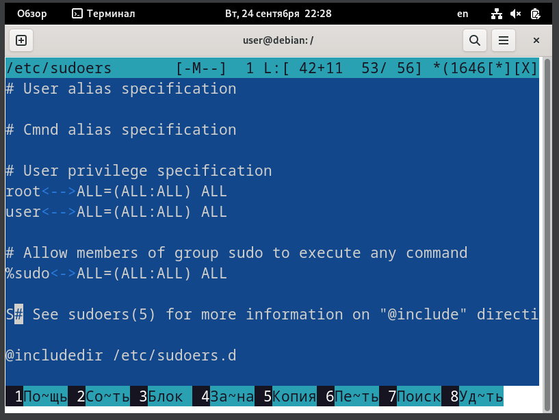
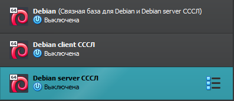
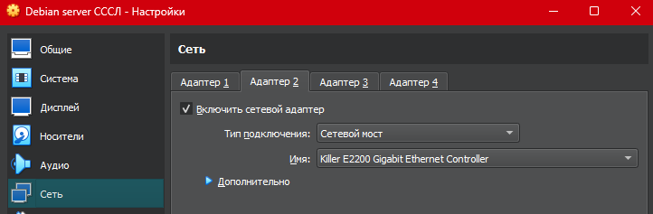
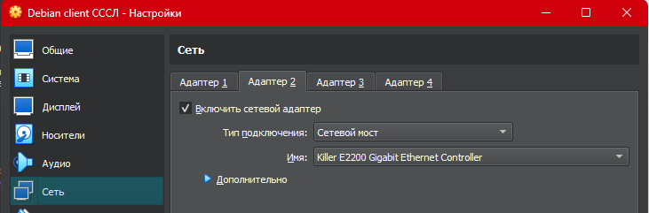

# Практика 1
## Макаров Михаил Максимович
## ББМО-02-23
Была создана ВМ с ОС Debian
Из под пользователя root: 
```bash
su root
```
Установили консольный менеджер файлов mc
Отредактировали файл sudoers, добавив пользователю user права на sudo
Выполнили обновление системы, установили пакеты, необходимые для дополнений VBox
Установили сами дополнения VBox


Выполненные команды

Файл /etc/sudoers

Создали две связные копии из имеющийся виртуальной машины и настроили между ними сетевой мост

2 новые ВМ


ВМ server


ВМ client
